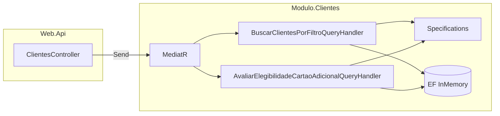

# Funcionamento do SpecificationDemo

Este documento descreve como a solução está organizada, como o **Specification Pattern** entra nos **casos de uso** e o que esperar das respostas da API. Tudo o que se segue é **material de estudo** com dados fictícios.

## Visão geral da arquitetura

A solução segue uma separação em camadas com **módulo autocontido** e **host HTTP**:

| Peça | Projeto | Função |
|------|---------|--------|
| Host HTTP | `SpecificationDemo.Web.Api` | Controladores, `Program.cs`, OpenAPI em Development |
| Módulo | `SpecificationDemo.Modulo.Clientes` | Domínio, EF Core In-Memory, casos de uso |
| Mensagens / orquestração | MediatR (`IRequest`, `IRequestHandler`) | Padrão request/handler para casos de uso |

O módulo expõe `AddModuloClientes()` em `InjecaoDeDependencia/InjecaoDeDependenciaDoModuloClientes.cs`, que regista o `DbContext` e os handlers MediatR.



## Domínio: entidade `Cliente`

A entidade `Cliente` (`Dominio/Clientes/Cliente.cs`) contém os campos usados nas regras de exemplo:

- `Ativo`, `Bloqueado`, `Idade`, `Score`, `RendaMensal`

Os dados iniciais vêm de `HasData` em `ContextoDeClientes` (seed fixo com GUIDs estáveis para testes manuais e Postman).

## Specification Pattern neste projeto

### Classe base

`Dominio/Specifications/Specification.cs` define:

- `ToExpression()` — `Expression<Func<T, bool>>` para usar em `IQueryable.Where(...)` no **EF Core**
- `IsSatisfiedBy(T)` — avalia uma instância já carregada (útil para elegibilidade e testes)
- `And` / `Or` — composição com **um único parâmetro** na expressão final (substituição de parâmetro), evitando `Expression.Invoke`, que costuma **não** ser traduzido para SQL

### Regras atómicas

Exemplos em `Dominio/Specifications/`:

- `ClienteAtivoSpecification`
- `ClienteMaiorDeIdadeSpecification`
- `ScoreMinimoSpecification(decimal)`
- `ClienteSemBloqueioSpecification` (satisfeita quando **não** está bloqueado)
- `RendaMinimaSpecification(decimal)`

### Composição de negócio

`CartaoAdicionalElegivelSpecification.Criar(scoreMinimo, rendaMinima)` devolve uma specification **composta** (ativo, sem bloqueio, score, renda, maior de idade), alinhada ao exemplo “cartão adicional” da discussão de domínio.

## Casos de uso

### 1. Buscar clientes por filtro (query + EF)

**Pasta:** `CasosDeUso/Clientes/BuscarClientesPorFiltro/`

O handler começa com uma specification “sempre verdadeira” e, **consoante os parâmetros da query**, encadeia `And(...)` com specifications concretas. No fim:

```csharp
contexto.Clientes.AsNoTracking().Where(spec.ToExpression())
```

Ou seja, o **caso de uso** decide *quais* critérios compor; o **EF** traduz para filtro sobre a tabela em memória.

**Query string opcional:**

| Parâmetro | Tipo | Efeito |
|-----------|------|--------|
| `apenasAtivos` | `bool` | Se `true`, exige `ClienteAtivoSpecification` |
| `idadeMinima` | `int` | Idade mínima (`>=`) |
| `scoreMinimo` | `decimal` | Score mínimo (`>=`) |

Parâmetros omitidos **não** aplicam esse filtro.

### 2. Avaliar elegibilidade para cartão adicional

**Pasta:** `CasosDeUso/Clientes/AvaliarElegibilidadeCartaoAdicional/`

Fluxo:

1. Carrega o cliente por `Id` (tracking desligado).
2. Se não existir, lança `ClienteNaoEncontradoException` → API responde **404** com `{ "mensagem": "..." }`.
3. Percorre uma lista de pares *(mensagem se falhar, specification)*: se `!spec.IsSatisfiedBy(cliente)`, acrescenta o texto a `motivosDeRecusa`.
4. Calcula `elegivel` com a specification **composta** `CartaoAdicionalElegivelSpecification.Criar(...)`.

**Query string:**

| Parâmetro | Tipo | Valor por omissão |
|-----------|------|-------------------|
| `scoreMinimo` | `decimal` | `650` |
| `rendaMinima` | `decimal` | `3000` |

## Dados de seed (para testes)

| ID (GUID) | Nome | Notas |
|-----------|------|--------|
| `11111111-1111-1111-1111-111111111111` | Ana Elegível | Cumpre todas as regras com os defaults 650 / 3000 |
| `22222222-2222-2222-2222-222222222222` | Bruno Score Baixo | Score 580 &lt; 650 |
| `33333333-3333-3333-3333-333333333333` | Carla Bloqueada | `Bloqueado = true` |
| `44444444-4444-4444-4444-444444444444` | Daniel Menor | Idade 17 |

## Respostas JSON (formato)

### `GET /api/clientes`

```json
{
  "itens": [
    {
      "id": "...",
      "nome": "...",
      "ativo": true,
      "idade": 32,
      "score": 720,
      "bloqueado": false,
      "rendaMensal": 5500
    }
  ]
}
```

### `GET /api/clientes/{id}/elegibilidade-cartao-adicional`

```json
{
  "elegivel": false,
  "motivosDeRecusa": [
    "Score abaixo do mínimo exigido."
  ]
}
```

## Swagger UI (testar cenários no browser)

Em **Development**, a API expõe **Swagger UI** em **`/swagger`** (Swashbuckle). Permite:

- **`GET /api/clientes`**: preencher `apenasAtivos`, `idadeMinima`, `scoreMinimo` e usar **Try it out** para combinar filtros.
- **`GET /api/clientes/{clienteId}/elegibilidade-cartao-adicional`**: colar um GUID de seed e ajustar `scoreMinimo` / `rendaMinima` para ver `elegivel` e `motivosDeRecusa`.

A descrição no topo da página Swagger resume os GUIDs e o significado de cada cenário.

## Ciclo de vida da base In-Memory

Cada processo da API tem uma instância nova da base em memória. Reiniciar `dotnet run` repõe os dados de seed.
